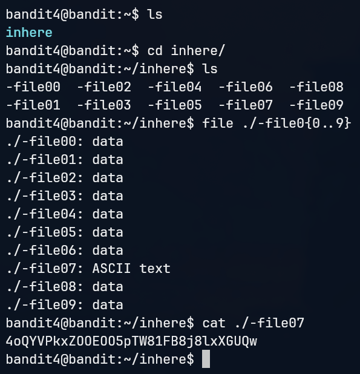
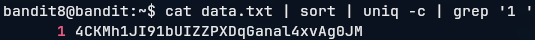

# This is my attempt to complete the OverTheWire: Bandit wargame

## Level 0

### Objective

The goal of this level is for you to log into the game using SSH. The host to which you need to connect is bandit.labs.overthewire.org, on port 2220. The username is bandit0 and the password is bandit0. Once logged in, go to the Level 1 page to find out how to beat Level 1.

### Answer

Command to log-in into the game:

`ssh bandit0@bandit.labs.overthewire.org -p 2220`

Password: bandit0

## Level 0 -> Level 1

### Objective

The password for the next level is stored in a file called readme located in the home directory. Use this password to log into bandit1 using SSH. Whenever you find a password for a level, use SSH (on port 2220) to log into that level and continue the game.

### Answer

Ran `ls` to find the 'readme' file and `less readme` to see the password inside of that file.

> ZjLjTmM6FvvyRnrb2rfNWOZOTa6ip5If

Next i should disconnect from the bandit0 profile and log-in into the bandit1 profile using the given password.

## Level 1 -> Level 2

### Objective

The password for the next level is stored in a file called - located in the home directory

### Answer

Dashed filename or a file that starts with an dash can mess with the shell because the interpreter can see it as an command flag, causing the system to wait the infinitely for the argument. To avoid this, we can explicitly use relative or absolute paths, or use the double dash (--) to end arguments.

So i ran `cat ./-` to get the following password.

> 263JGJPfgU6LtdEvgfWU1XP5yac29mFx

Now i can log-in with 'bandit2' user using that password.

## Level 2 -> Level 3

### Objective

The password for the next level is stored in a file called --spaces in this filename-- located in the home directory

### Answer

Spaces in file names it's a common problem and can cause errors in command-line environments, even being technically permitted. To interact with that file, i can simply wrap the file name in quotes and calling it by the relative path

So i ran `cat ./'--spaces in this finename--'` to get the following password.

> MNk8KNH3Usiio41PRUEoDFPqfxLPlSmx

Now i can log-in with 'bandit3' user using that password.

## Level 3 -> Level 4

### Objective

The password for the next level is stored in a hidden file in the inhere directory.

### Answer

Simple task, just change directory to the specified folder and ran `ls -a` to see hidden files inside that folder. After finding the file name called "...Hidding-from-you", i could ran cat ...Hidding-from-you to get the following password.

> 2WmrDFRmJIq3IPxneAaMGhap0pFhF3NJ

Now i can log-in with 'bandit4' user using that password.

## Level 4 -> Level 5

### Objective

The password for the next level is stored in the only human-readable file in the inhere directory. Tip: if your terminal is messed up, try the “reset” command.

### Answer

Not as simple as the last one. We need to verify the human-readable file between 9 files, but we can't check one-by-one cause the wrong file's can mess with the terminal. To avoid that, we can use the `file` command to classify every file type and search for the only human-readable, as we can see in the picture bellow. It's important to note that there are dashed filenames, so we need to use relative or absolute path name to these directories.

> 4oQYVPkxZOOEOO5pTW81FB8j8lxXGUQw

Now i can log-in with 'bandit5' user using that password.

## Level 5 -> Level 6

### Objective

The password for the next level is stored in a file somewhere under the inhere directory and has all of the following properties:

human-readable
1033 bytes in size
not executable

### Answer

Now we need to play with some options of the `find` command. I pick `-readable` to see the human-readable files, `-type f -size 1033c` to only show files that has exactly 1033 bytes (c stands for bytes) and `-not -executable` to match that last filter. The result is a file that contains the following password.

> HWasnPhtq9AVKe0dmk45nxy20cvUa6EG

Now i can log-in with 'bandit6' user using that password.

## Level 6 -> Level 7

### Objective

The password for the next level is stored somewhere on the server and has all of the following properties:

owned by user bandit7
owned by group bandit6
33 bytes in size

### Answer

Similar to the previous level, we need to play with some options of the `find` command. We already know how to find by type and size, now we just need to provide the options `-user bandit7 -group bandit6` to match the asked properties. The password is hidden inside the server, so we need to check in the root file system. We ran `find / -type f -size 33c -user bandit7 -group bandit6`, the find command will try to check inside some not allowed folders and somewhere between all the "Permission denied" logs we can find the directory of the password, and the password as follows.

> morbNTDkSW6jIlUc0ymOdMaLnOlFVAaj

Now i can log-in with 'bandit7' user using that password.

## Level 7 -> Level 8

### Objective

The password for the next level is stored in the file data.txt next to the word millionth

### Answer

Thankfully another easy level. We don't need to search the file, because it is on the home directory, so we can just ran `grep millionth data.txt` to get the following password.

> dfwvzFQi4mU0wfNbFOe9RoWskMLg7eEc

Now i can log-in with 'bandit8' user using that password.

## Level 8 -> Level 9

### Objective

The password for the next level is stored in the file data.txt and is the only line of text that occurs only once

### Answer

Not as easy than the last one. This level we were introduced to piping, strongly and useful way of connecting command outputs. To get our password, we will do a mix of commands to properly see the correct password. First we need to output the content of the same file we see on the previous level by using `cat` command. So we 'pipe' that output using `|` and writing the command we want to use with the output of `cat`, in this case, we wanna `sort` that output. Now we can pipe again to a command called `uniq`, in addition to the `-c` option we can already see our password. But to only get the password as output, we can lastly pipe it to `grep` and specify the '1 ' pattern that matches the line of the password, which give us the bellow result.

> 4CKMh1JI91bUIZZPXDqGanal4xvAg0JM

Now i can log-in with 'bandit9' user using that password.

## Level 9 -> Level 10

### Objective

The password for the next level is stored in the file data.txt in one of the few human-readable strings, preceded by several ‘=’ characters.

### Answer

Not as easy than the last one. This level we were introduced to piping, strongly and useful way of connecting command outputs. To get our password, we will do a mix of commands to properly see the correct password. First we need to output the content of the same file we see on the previous level by using `cat` command. So we 'pipe' that output using `|` and writing the command we want to use with the output of `cat`, in this case, we wanna `sort` that output. Now we can pipe again to a command called `uniq`, in addition to the `-c` option we can already see our password. But to only get the password as output, we can lastly pipe it to `grep` and specify the '1 ' pattern that matches the line of the password, which give us the bellow result.

> 4CKMh1JI91bUIZZPXDqGanal4xvAg0JM

Now i can log-in with 'bandit9' user using that password.
